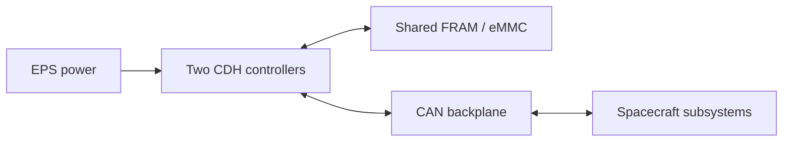

# CDH Controller

Coordinates spacecraft operations, processes commands received through COMMS,
and collects and stores subsystem health and mission data.

Owner: Levi Dockstader | PCB version: v0.6 | Last reviewed: 2026-10-02
Board files: [hardware](../hardware/) | Related documents: see Section 5.

## 1. Purpose & Design

CDH coordinates subsystem activity, maintains operating state, processes commands,
monitors subsystem health, and manages telemetry. EPS supplies and controls power;
COMMS provides the radio link; ADCS performs attitude control; GNSS supplies
navigation information.

The v0.6 architecture uses two STM32U5A5RJTx controllers with separate
3.3 V supplies, CAN interfaces, shared peripheral selection, recovery FRAM, and
bulk eMMC storage. Redundancy adds recovery capability but requires coordinated
power sequencing and exclusive peripheral ownership.

Only the selected controller issues spacecraft commands or writes to shared
storage. An inactive controller must not interfere with the selected controller
or unintentionally power the other supply domain.

## 2. Specifications

| Specification   | Value / limit               | Notes                                      |
|-----------------|-----------------------------|--------------------------------------------|
| Input power     | Two nominal 3.3 V supplies  | EPS manages power input                    |
| Power use       | Estimated consumption TBD   | Establish measured hardware baseline       |
| Controller      | Two STM32U5A5RJTx devices   | This MCU is our standard controller choice |
| Communication   | Satellite-wide CAN bus      | Current firmware interface baseline        |
| Storage         | Three FRAM devices and eMMC | v0.6 includes an 8 GB-designated eMMC      |
| Performance     | Acceptance conditions TBD   | Monitor speed, power, EMI, and FDIR        |
| Size / mounting | Match mechanical interface  | Coordinate with structure requirements     |
| Environment     | See UNP space requirements  | Temperature, radiation, and vacuum limits  |

## 3. Interfaces

### Backplane power and CAN

The following assignments are the documented v0.6 baseline.

| Pin / signal  | Direction*    | Function / electrical limits              |
|---------------|---------------|-------------------------------------------|
| 9 / CDH1_3V3  | Input         | Controller 1 supply, nominal 3.3 V        |
| 11 / CDH2_3V3 | Input         | Controller 2 supply, nominal 3.3 V        |
| 36 / GND      | Reference     | System ground                             |
| 38 / CANL     | Bidirectional | CAN low                                   |
| 40 / CANH     | Bidirectional | CAN high                                  |
| Other pins    | TBD           | Check datasheet before assigning new pins |

The schematic lists connector `IPS1-120-01-L-D-RA`. Supply current
limits, grounding, startup order and CAN termination shall be agreed with the
backplane/EPS design.

### SWD programming/debug

| Pin / signal | Direction* | Function / electrical limits |
|--------------|------------|------------------------------|
| 1 / GND | Reference | System ground |
| 2 / VREF | Reference | Direct target 3.3 V connection; bypasses protection according to the board documentation |
| 3 / SWCLK | Input | Debug clock |
| 4 / SWDIO | Bidirectional | Debug data |
| 5 / NRST | Reset net | Active-low reset |

*Direction is relative to CDH.*

### Commands and data

CHD receives commands through COMMS, sends power requests to EPS, collects
subsystem heartbeats/health data, requests GNSS information, and routes telemetry
to COMMS.

## 4. Operation & Limitations

- **Power and startup:** Allowable power supply tolerances need defined. Protection
  circuitry limits current and voltage spikes. Shared paths between circuits must
  not backfeed into an unpowered portion of the board.
- **Controller selection:** Shared-peripheral muxes connect only one controller
  at a time.
- **Reset and recovery:** The external watchdog assert the intended MCU's
  reset input when its input pulses stop.
- **Storage and power loss:** Power-loss hold-up time and any hardware shutdown
  indication remain TBD; completion of an in-progress write cannot be assumed 
  when power is removed.

## 5. Notes

Before relying on recovery or storage, resolve the documented eMMC mapping and
FRAM communication issues, prototype protection/reset/recovery wiring defects,
and watchdog-pin and mux-reset conflicts.
